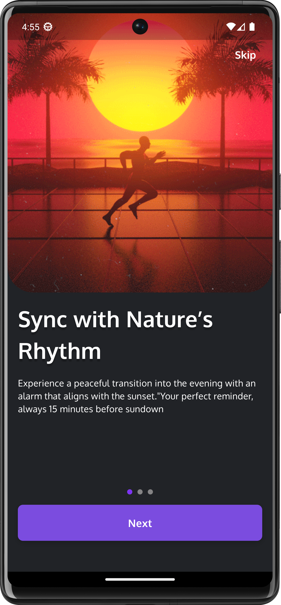
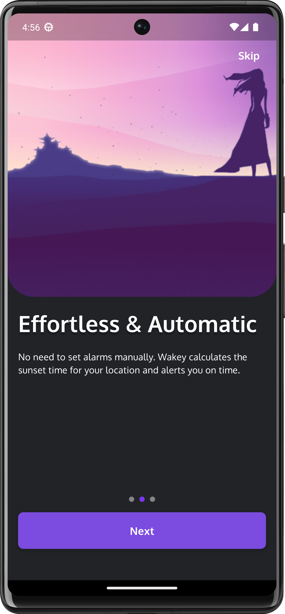
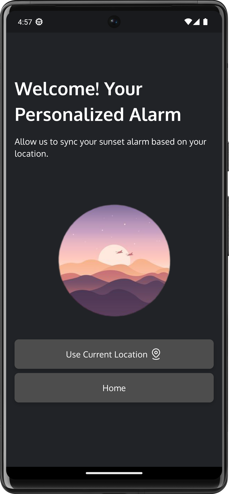
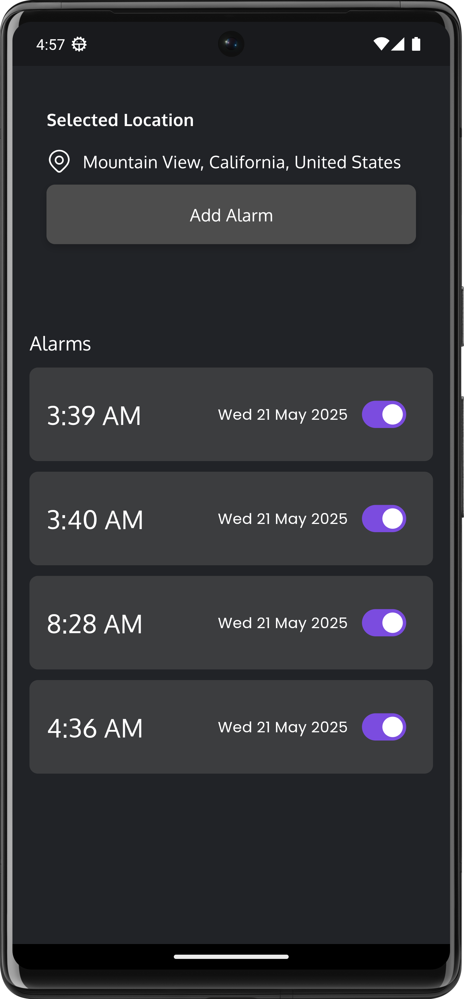

# Alarm App

A cross-platform alarm application built with Flutter.

## Screenshots

<p align="center">
  
  
  
  
  
</p>

## Features
- Beautiful onboarding experience
- Set and manage alarms
- Display current location
- Local notifications

## Project Setup Instructions

1. **Clone the repository:**
   ```bash
   git clone https://github.com/zsifat/alarm_app
   cd alarm_app
   ```
2. **Install dependencies:**
   ```bash
   flutter pub get
   ```
3. **Run the app:**
   - For Android/iOS:
     ```bash
     flutter run
     ```
   - For Web:
     ```bash
     flutter run -d chrome
     ```
   - For Windows/Linux/MacOS:
     ```bash
     flutter run -d windows # or linux, macos
     ```

## Tools/Packages Used

- [Flutter](https://flutter.dev/) (SDK ^3.6.2)
- [flutter_bloc](https://pub.dev/packages/flutter_bloc)
- [permission_handler](https://pub.dev/packages/permission_handler)
- [geolocator](https://pub.dev/packages/geolocator)
- [smooth_page_indicator](https://pub.dev/packages/smooth_page_indicator)
- [google_fonts](https://pub.dev/packages/google_fonts)
- [flutter_svg](https://pub.dev/packages/flutter_svg)
- [equatable](https://pub.dev/packages/equatable)
- [geocoding](https://pub.dev/packages/geocoding)
- [intl](https://pub.dev/packages/intl)
- [shared_preferences](https://pub.dev/packages/shared_preferences)
- [flutter_local_notifications](https://pub.dev/packages/flutter_local_notifications)
- [timezone](https://pub.dev/packages/timezone)
- [android_intent_plus](https://pub.dev/packages/android_intent_plus)

## Assets
- Images, GIFs, and SVGs are located in the `assets/images/`, `assets/gifs/`, and `assets/svg/` directories.

---

Feel free to contribute or open issues for suggestions and bug reports!
